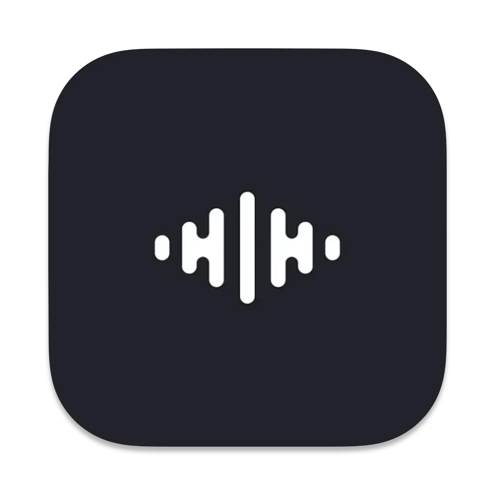
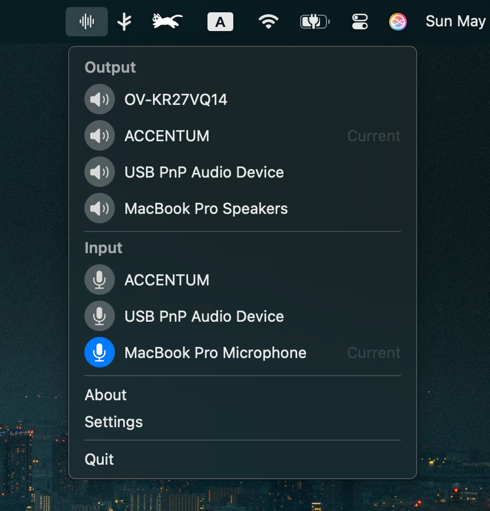
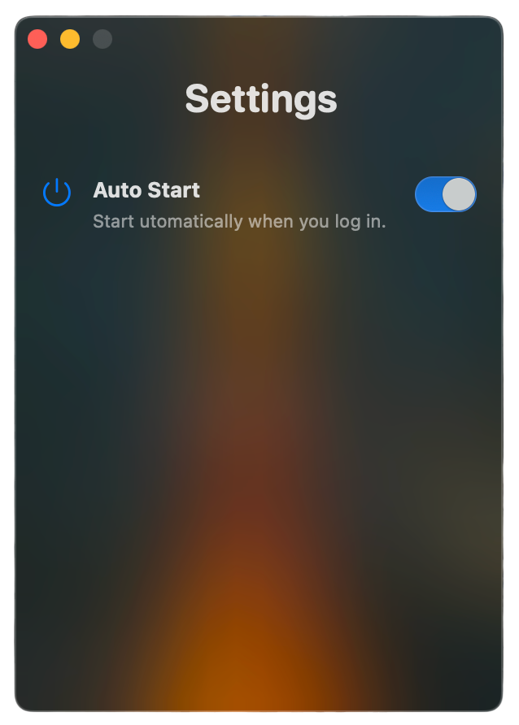
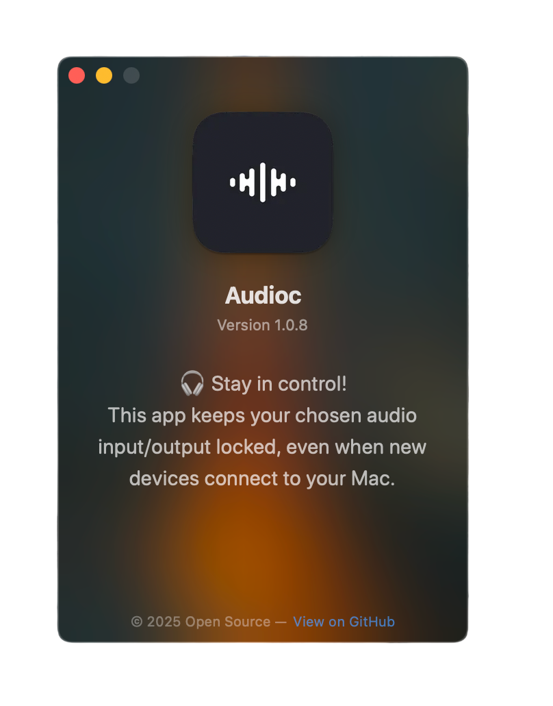

  

<h1 align="center">Audioc</h1>

  A simple, smart way to control which input and output audio devices your Mac uses—no matter what gets plugged in.

---

## Features

- 🟢 **Menu Bar Utility:** Lives quietly in your macOS menu bar for easy access
- 🎛️ **Device Preference:** Choose your preferred input and output devices—individually
- 🔄 **Auto-Restore:** Remembers your last choices and restores them automatically
- 🚀 **Auto-Launch:** Optionally start on login for a seamless experience
- 🔒 **Privacy First:** No data collected, no permissions required, all settings local
- 🆓 **Open Source:** MIT licensed and free to use

---

## Why AudioC?

**macOS automatically switches audio input and output to new devices (like headphones or AirPods) as soon as they're connected—even if you prefer to use your MacBook's mic or speakers for certain tasks.**

AudioC gives you full control. Set your preferred input and output devices for every scenario. When you connect a new device, AudioC keeps things the way you want them—music on your MacBook speakers, voice through your headset, or any combination you choose.

---

## Screenshots

| Menu Bar                                         | Settings Page                                    | About Page                                    |
|:------------------------------------------------:|:------------------------------------------------:|:---------------------------------------------:|
|                  |             |             |

---

## Installation

- **Option 1: Download**  
  Grab the latest pre-built app from the [Releases page](../../releases).

- **Option 2: Build from Source**  
  1. Download or clone this repository.
  2. Open the project in Xcode (macOS 14+ required).
  3. Build & Run.

---

## Usage

1. Launch Audioc. The icon will appear in your macOS menu bar (top right).
2. Click the icon to open the controll panel.
3. Select your preferred input and output audio devices.
4. Audioc will remember your preferences and restore them—even after reconnecting devices or rebooting.
5. Change your choices anytime!

---

## Contributing

Pull requests, bug reports, and suggestions are **very welcome**!  
Feel free to open an [issue](../../issues) or [pull request](../../pulls) any time.

---

# License

    Copyright 2025 Sina Dalvand

    Licensed under the Apache License, Version 2.0 (the "License");
    you may not use this file except in compliance with the License.
    You may obtain a copy of the License at

       http://www.apache.org/licenses/LICENSE-2.0

    Unless required by applicable law or agreed to in writing, software
    distributed under the License is distributed on an "AS IS" BASIS,
    WITHOUT WARRANTIES OR CONDITIONS OF ANY KIND, either express or implied.
    See the License for the specific language governing permissions and
    limitations under the License.
